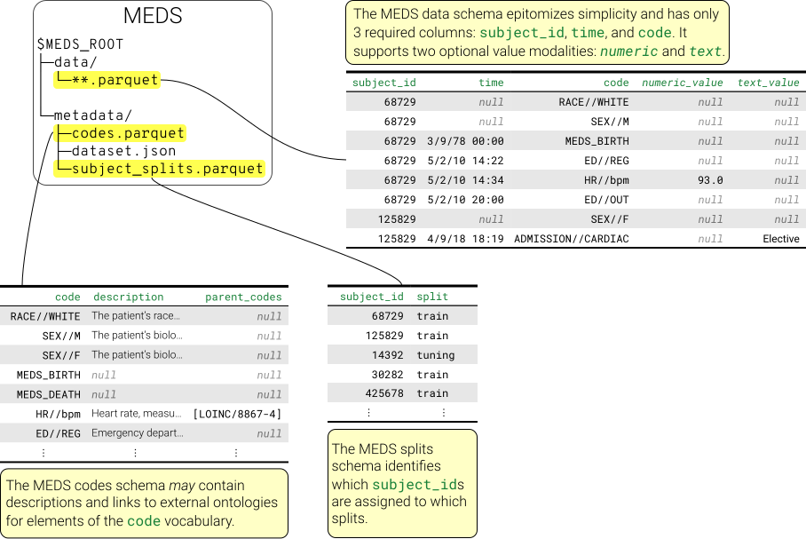

<p align="center">
  <picture>
    <source media="(prefers-color-scheme: dark)" srcset="static/logo_dark.svg">
    <source media="(prefers-color-scheme: light)" srcset="static/logo_light.svg">
    
  </picture>
</p>

# Medical Event Data Standard

[](https://pypi.org/project/meds/)

[](https://codecov.io/gh/Medical-Event-Data-Standard/meds)
[](https://github.com/Medical-Event-Data-Standard/meds/actions/workflows/tests.yml)
[](https://github.com/Medical-Event-Data-Standard/meds/actions/workflows/code-quality-main.yml)
[](https://github.com/Medical-Event-Data-Standard/meds#license)
[](https://github.com/Medical-Event-Data-Standard/meds/pulls)
[](https://github.com/Medical-Event-Data-Standard/meds/graphs/contributors)



The Medical Event Data Standard (MEDS) is a data schema for storing streams of medical events, often
sourced from either Electronic Health Records or claims records. For more information, tutorials, and
compatible tools see the website: https://medical-event-data-standard.github.io/.

## Table of Contents

- [Philosophy](#philosophy)
- [The Schemas](#the-schemas)
    - [`DataSchema`](#the-data-schema)
    - [`DatasetMetadataSchema`](#the-datasetmetadata-schema)
    - [`CodeMetadataSchema`](#the-codemetadata-schema)
    - [`SubjectSplitSchema`](#the-subjectsplit-schema)
    - [`LabelSchema`](#the-label-schema)
- [Organization on Disk](#organization-on-disk)
    - [Organization of task labels](#organization-of-task-labels)
- [Validation](#validation)
- [Example: MIMIC-IV demo dataset](#example-mimic-iv-demo-dataset)
- [Migrating from v0.3](#migrating)

## Philosophy

At the heart of MEDS is a simple yet powerful idea: nearly all EHR data can be modeled as a minimal tuple:

1. _subject_: The primary entity for which care observations are recorded. Typically, this is an individual
    with a complete sequence of observations. In some datasets (e.g., eICU), a subject may refer to a single
    hospital admission rather than the entire individual record.

2. _time_: The time that a measurement was observed.

3. _code_: The descriptor of what measurement is being observed.

> [!NOTE]
> MEDS also tracks optional "value" modalities that can be observed with any measurement in this tuple, such
> as a `numeric_value` or `text_value` in addition to the _subject_, _time_, and _code_ elements.

> [!NOTE]
> In this documentation, we will primarily use the term "measurement" to refer to a single observation about a
> subject at a given time (i.e., a row of MEDS data). We may use the term "event" to refer to this as well, or
> to refer to all measurements that occur at a unique point in time, depending on context.

## The Schemas

MEDS defines five primary schema components:

| **Component**           | **Description**                                                                                                                       | **Implementation** |
| ----------------------- | ------------------------------------------------------------------------------------------------------------------------------------- | ------------------ |
| `DataSchema`            | Describes the core medical data, organized as sequences of subject observations.                                                      | PyArrow            |
| `DatasetMetadataSchema` | Captures metadata about the source dataset, including its name, version, and details of its conversion to MEDS (e.g., ETL details).   | JSON               |
| `CodeMetadataSchema`    | Provides metadata for the codes used to describe the types of measurements observed in the dataset.                                   | PyArrow            |
| `SubjectSplitSchema`    | Stores information on how subjects are partitioned into subpopulations (e.g., training, tuning, held-out) for machine learning tasks. | PyArrow            |
| `LabelSchema`           | Defines the structure for labels that may be predicted about a subject at specific times in the subject record.                       | PyArrow            |

Below, each schema is introduced in detail. Usage examples and a practical demonstration with the [MIMIC-IV demo](https://physionet.org/content/mimic-iv-demo/2.2/) dataset are provided in a later section.

> [!IMPORTANT]
> Each component is implemented as a Schema class via the
> [`flexible_schema`](https://flexible-schema.readthedocs.io/en/latest/) package. This allows us to capture
> the fact that our schemas often are _open_ (they allow extra columns) and have optional columns (columns
> whose presence or absence does not affect the validity of a dataset). This package also provides convenient
> accessors to column names and dtypes as well as table / schema validation or alignment functionality. Under
> the hood, all schemas are still simple standard PyArrow schemas or JSON schemas, as indicated.

### The `DataSchema` schema

The `DataSchema` schema describes a structure for the underlying medical data. It contains the following columns:

| **Column Name** | **Conceptual Description**                                                                                         | **Type**             | **Required** | **Nullable**                                           |
| --------------- | ------------------------------------------------------------------------------------------------------------------ | -------------------- | ------------ | ------------------------------------------------------ |
| `subject_id`    | The ID of the subject (typically the patient).                                                                     | `pa.int64()`         | Yes          | No                                                     |
| `time`          | The time of the measurement.                                                                                       | `pa.timestamp('us')` | Yes          | Yes, for static measurements                           |
| `code`          | The primary categorical descriptor of the measurement (e.g., the performed laboratory test or recorded diagnosis). | `pa.string()`        | Yes          | No                                                     |
| `numeric_value` | Any numeric value associated with this measurement (e.g., the laboratory test result).                             | `pa.float32()`       | No           | Yes, for measurements that do no have a numeric value. |
| `text_value`    | Any text value associated with this measurement (e.g., the result of a text-based test, a clinical note).          | `pa.large_string()`  | No           | Yes, for measurements that do not have a text value.   |

In addition, the `DataSchema` schema is _open_, meaning it can contain any number of custom columns to further
enrich observations. Examples of such columns include further ID columns such as `hadm_id` or `icustay_id` to
uniquely identify events, additional value types such as `image_path`, and more.

#### Examples

Once you import the schema, you can see the underlying `PyArrow` schema, though this doesn't reflect the
optional or nullability requirements:

```python
>>> from meds import DataSchema
>>> DataSchema.schema()
subject_id: int64
time: timestamp[us]
code: string
numeric_value: float
text_value: large_string

```

You can also access the column names and dtypes programmatically via constants for use in your code:

```python
>>> DataSchema.subject_id_name
'subject_id'
>>> DataSchema.subject_id_dtype
DataType(int64)

```

In addition, you can validate or align tables to the schema to ensure your data is fully compliant (at the
level of a single data shard). Validation will raise an error if the table does not conform to the schema, or
return nothing:

```python
>>> import pyarrow as pa
>>> from datetime import datetime
>>> query_tbl = pa.Table.from_pydict({
...     "time": [
...         datetime(2021, 3, 1),
...         datetime(2021, 4, 1),
...         datetime(2021, 5, 1),
...     ],
...     "subject_id": [1, 2, 3],
...     "code": ["A", "B", "C"],
...     "extra_column_no_error": [1, 2, None],
... })
>>> DataSchema.validate(query_tbl) # No issues, even though numeric_value is missing and there is an extra column
>>> query_tbl = pa.Table.from_pydict({
...     "time": [
...         datetime(2021, 3, 1),
...         datetime(2021, 4, 1),
...         datetime(2021, 5, 1),
...     ],
...     "subject_id": [1.0, 2.0, 3.0],
...     "code": ["A", "B", "C"],
... })
>>> DataSchema.validate(query_tbl)
Traceback (most recent call last):
    ...
flexible_schema.exceptions.SchemaValidationError:
    Columns with incorrect types: subject_id (want int64, got double)

```

Validation also checks for nullability violations:

```python
>>> query_tbl = pa.Table.from_pydict({
...     "time": [None, None, None],
...     "subject_id": [None, 2, 3],
...     "code": ["A", "B", "C"],
...     "numeric_value": [1.0, 2.0, 3.0],
...     "text_value": [None, None, None],
... }, schema=DataSchema.schema())
>>> DataSchema.validate(query_tbl)
Traceback (most recent call last):
    ...
flexible_schema.exceptions.TableValidationError: Columns that should have no nulls but do: subject_id

```

Alignment performs some modest type coercion and column re-ordering to return a version of the table that does
conform to the schema, where possible (or it throws an error):

```python
>>> query_tbl = pa.Table.from_pydict({
...     "time": [
...         datetime(2021, 3, 1),
...         datetime(2021, 4, 1),
...         datetime(2021, 5, 1),
...     ],
...     "subject_id": [1.0, 2.0, 3.0],
...     "code": ["A", "B", "C"],
... })
>>> DataSchema.align(query_tbl)
pyarrow.Table
subject_id: int64
time: timestamp[us]
code: string
----
subject_id: [[1,2,3]]
time: [[2021-03-01 00:00:00.000000,2021-04-01 00:00:00.000000,2021-05-01 00:00:00.000000]]
code: [["A","B","C"]]

```

> [!NOTE]
> See the [`flexible_schema`](https://flexible-schema.readthedocs.io/en/latest/) documentation for more
> details on how the schema objects function.

#### Canonical Codes

The `code` column in the `DataSchema` schema is a string that describes the type of measurement being observed. In
general, there are _no restrictions_ on the vocabularies used in this column. However, MEDS does define two
codes for general use that are likely to be applicable to nearly all MEDS datasets:

| **Code**     | **Import**        | **Description**      | **Absolute or Prefix?**                                         |
| ------------ | ----------------- | -------------------- | --------------------------------------------------------------- |
| `MEDS_BIRTH` | `meds.birth_code` | The subject is born. | May be used either alone or as a prefix (e.g., `MEDS_BIRTH//*`) |
| `MEDS_DEATH` | `meds.death_code` | The subject dies.    | May be used either alone or as a prefix (e.g., `MEDS_DEATH//*`) |

```python
>>> from meds import birth_code, death_code
>>> print(f"{birth_code}, {death_code}")
MEDS_BIRTH, MEDS_DEATH

```

### The `DatasetMetadataSchema` schema

The `DatasetMetadataSchema` JSON schema structures essential information about the source dataset and its conversion
to MEDS. It includes details such as the dataset’s name, version, and licensing, as well as specifics about
the ETL process used for transformation. All fields in this schema are optional.

Fields:

1. `dataset_name`: The name of the dataset.
2. `dataset_version`: The version of the dataset.
3. `etl_name`: The name of the ETL process that generated the MEDS dataset.
4. `etl_version`: The version of the ETL process.
5. `meds_version`: The version of the MEDS format used.
6. `created_at`: The creation date and time (in ISO 8601 format).
7. `license`: The license under which the dataset is released.
8. `location_uri`: The URI where the dataset is hosted.
9. `description_uri`: The URI containing a detailed description of the dataset.
10. `raw_source_id_columns`: A list of columns in the data that are not part of the core MEDS data schema
    and contain identifiers or join keys to the raw source data. These will typically have no use outside of
    join operations in downstream modeling steps.
11. `code_modifier_columns`: A list of columns in the data that are not part of the core MEDS data schema and
    contain "code modifiers" -- meaning columns that should be seen to "modify" the core code. For example, a
    code modifier might be a column that indicates the "unit" of a measurement, or a column that indicates the
    priority assigned to a laboratory test order. These columns are typically useful during subsequent
    pre-processing steps to enrich code group-by operations for aggregating over codes. These columns should
    all appear in the data schema and be strings.
12. `additional_value_modality_columns`: A list of columns in the data that are not part of the core MEDS data
    schema but contain additional "value modalities" beyond numeric or text. These may include paths to
    imaging or waveform data, for example. Columns with consistent names that are used in this way will
    eventually be considered for promotion into the core MEDS schema.
13. `site_id_columns`: A list of columns in the data that are not part of the core MEDS data schema and
    contain identifiers for the site of care.
14. `other_extension_columns`: A list of columns in the data that are not part of the core MEDS data schema and
    contain other columns beyond those described above.

#### Examples

Like before, you can see the underlying JSON schema, access field names and types, and validate prospective
JSON blobs. You can't align JSON blobs, as that functionality only exists for `PyArrow` tables.

```python
>>> from meds import DatasetMetadataSchema
>>> DatasetMetadataSchema.schema()
{'type': 'object',
 'properties': {'dataset_name': {'type': 'string'},
                'dataset_version': {'type': 'string'},
                'etl_name': {'type': 'string'},
                'etl_version': {'type': 'string'},
                'meds_version': {'type': 'string'},
                'created_at': {'type': 'string', 'format': 'date-time'},
                'license': {'type': 'string'},
                'location_uri': {'type': 'string'},
                'description_uri': {'type': 'string'},
                'raw_source_id_columns': {'type': 'array', 'items': {'type': 'string'}},
                'code_modifier_columns': {'type': 'array', 'items': {'type': 'string'}},
                'additional_value_modality_columns': {'type': 'array', 'items': {'type': 'string'}},
                'site_id_columns': {'type': 'array', 'items': {'type': 'string'}},
                'other_extension_columns': {'type': 'array', 'items': {'type': 'string'}}},
 'required': [],
 'additionalProperties': True}
>>> DatasetMetadataSchema.dataset_name_name
'dataset_name'
>>> DatasetMetadataSchema.dataset_name_dtype
{'type': 'string'}
>>> DatasetMetadataSchema.validate({"dataset_name": "MIMIC-IV"}) # No issue
>>> DatasetMetadataSchema.validate({"dataset_name": "MIMIC-IV", "dataset_version": 3.1}) # Error
Traceback (most recent call last):
    ...
flexible_schema.exceptions.TableValidationError: Table validation failed

```

This schema is intended to capture the context and provenance of the dataset. A MEDS-compliant dataset should
include this metadata to provide users with a clear understanding of the data's origin and how it was
transformed into the MEDS format. Note that since this schema is about a single entity, it is the only one
defined as a JSON schema.

### The `CodeMetadataSchema` schema

The `CodeMetadataSchema` schema provides additional details on how to describe the types of measurements (=codes)
observed in the MEDS dataset. It is designed to include metadata such as human-readable descriptions and
ontological relationships for each code. As with the `DataSchema` schema, the `CodeMetadataSchema` schema can contain any
number of custom columns to further describe the codes contained in the dataset.

> [!IMPORTANT]
> The `code` column in the `CodeMetadataSchema` schema is required to contain all unique codes found in the
> corresponding raw MEDS dataset (though this property may or may not hold after pre-processing steps happen).
> This ensures that downstream users can reliably scan the "vocabulary" of the dataset without processing all
> shards. Helpers to ensure this can be added easily to any dataset that is otherwise valid are being added
> currently; see #86 to follow developments here.

> [!NOTE]
> It is also not guaranteed that the rows in this table will all be unique w.r.t. the `code` column. Certain
> datasets may have "code modifiers" that exist as extension columns in the `DataSchema` schema but are essential to
> capturing the unique meaning of codes -- these columns may expand the number of rows in the code metadata to
> include all combinations of the code and its modifiers.

| **Column Name** | **Conceptual Description**                                                                                                                                                               | **Type**                | **Required** | **Nullable** |
| --------------- | ---------------------------------------------------------------------------------------------------------------------------------------------------------------------------------------- | ----------------------- | ------------ | ------------ |
| `code`          | The primary categorical descriptor of a possible measurement in the corresponding dataset. Links to the `DataSchema` schema on the `code` column.                                        | `pa.string()`           | Yes          | No           |
| `description`   | A human-readable description of what this code means.                                                                                                                                    | `pa.string()`           | No           | Yes          |
| `parent_codes`  | A list of string identifiers for higher-level or parent codes in an ontological hierarchy. These may link to other codes in this MEDS dataset or external vocabularies (e.g., OMOP CDM). | `pa.list_(pa.string())` | No           | Yes          |

#### Usage

```python
>>> from meds import CodeMetadataSchema
>>> CodeMetadataSchema.schema()
code: string
description: string
parent_codes: list<item: string>
  child 0, item: string

```

Validation and alignment work much as they do for the `DataSchema` schema.

> [!NOTE]
> The fact that all data codes should appear in this file is not captured in the `validate` or `align` methods
> on the `CodeMetadataSchema` schema. This is because that validation requires knowledge of not just the code
> metadata table, but also the raw data itself.

### The `SubjectSplitSchema` schema

The `SubjectSplitSchema` schema defines how subjects were partitioned into groups for machine learning tasks. This
schema is _closed_ (it does not permit additional columns) and consists of just two mandatory, non-nullable
fields:

1. `subject_id`: The ID of the subject. This serves as the join key with the core MEDS data.
2. `split`: The name of the assigned split.

#### Examples:

```python
>>> from meds import SubjectSplitSchema
>>> SubjectSplitSchema.schema()
subject_id: int64
split: string

```

#### Sentinel Split Names:

In line with common practice, MEDS also defines three sentinel split names for convenience and shared processing:

1. `train`: For model training.
2. `tuning`: For hyperparameter tuning (often referred to alternatively as the "validation" or "dev" set).
    In many cases, a tuning split may not be necessary and can be merged with the training set.
3. `held_out`: For final model evaluation (also commonly called the "test" set). When performing benchmarking,
    this split should **not** be used for any purpose except final model validation.

These sentinel names are available as exported variables:

```python
>>> from meds import train_split, tuning_split, held_out_split
>>> print(f"{train_split}, {tuning_split}, {held_out_split}")
train, tuning, held_out

```

### The `LabelSchema` schema

The `LabelSchema` schema dictates how prediction task labels are stored. It is designed primarily for use with tasks
that satisfy the following:

1. A given subject may have one or more labels predicted as-of one or more times within their record (in
    contrast to, for example, a prediction that is made on every event in the record).
2. The label for a given task is either
    - boolean (e.g., "will the subject die?").
    - numeric (e.g., "what is the subject's blood pressure?").
    - ordinal (e.g., "what is the subject's SOFA score?").
    - categorical (e.g., "what is the subject's diagnosis?").

Further, we will use the term `sample` to reflect a single triple of Subject ID, as-of prediction time, and
label -- i.e., a row in the label dataframe. This will differentiate from a "subject" (who may have a variable
number of labels observed).

The `LabelSchema` schema is _closed_ and contains the following columns. First, it has two mandatory, non-nullable
columns:

1. `subject_id`: The ID of the subject. This serves as the join key with the core MEDS data.
2. `prediction_time`: Data up to and including this time can be used to predict the given label for this subject-sample.

> [!IMPORTANT]
> Note that:
>
> - The prediction time is neither the _time of the predicted event/label_ nor precisely the time _at which
>     the prediction would be made in deployment_, but rather signifies the _inclusive endpoint_ of the data
>     that can be used to predict the label for the given sample.
> - The prediction time _may not correspond to an observed event time for the subject in the data._ This
>     means you will need to generally use "as-of" joins to capture the relevant windows of time that are
>     permissible (e.g., a join that matches to the last row with a timestamp less than or equal to the
>     prediction time).

In addition to the `subject_id` and `prediction_time`, the `LabelSchema` schema contains four additional, optional,
_not nullable_ columns that capture the different kinds of labels that can be observed.
Note that these columns are optional (they may or may not be present) but _not_ nullable (if they are present,
they should have uniformly observed values). Only one of these columns should generally be populated:

1. `boolean_value`: The label for a boolean task.
2. `integer_value`: The label for tasks taking on integral values (e.g., ordinal tasks or integral numeric
    tasks).
3. `float_value`: The label for tasks taking on float values (e.g., continuous numeric tasks)
4. `categorical_value`: The label for tasks taking on categorical values.

#### Examples:

```python
>>> from meds import LabelSchema
>>> LabelSchema.schema()
subject_id: int64
prediction_time: timestamp[us]
boolean_value: bool
integer_value: int64
float_value: float
categorical_value: string
>>> LabelSchema.validate(pa.Table.from_pydict({
...     "subject_id": [1, 2, 3],
...     "prediction_time": [datetime(2021, 3, 1), datetime(2021, 4, 1), datetime(2021, 5, 1)],
...     "boolean_value": [True, False, False],
... })) # No issue
>>> LabelSchema.validate(pa.Table.from_pydict({
...     "subject_id": [1, 2, 3],
...     "prediction_time": [datetime(2021, 3, 1), datetime(2021, 4, 1), datetime(2021, 5, 1)],
...     "categorical_value": ["high", None, "low"],
... }))
Traceback (most recent call last):
    ...
flexible_schema.exceptions.TableValidationError:
    Columns that should have no nulls but do: categorical_value

```

## Organization on Disk

A MEDS dataset is organized under a root directory (`$MEDS_ROOT`) into several subfolders corresponding to the
different schema components. Below is an overview of the directory structure:

- **`$MEDS_ROOT/data/*`**

    - Contains the event data files following the `DataSchema` schema.
    - Data is stored as a series of (possibly nested) sharded DataFrames in `parquet` format.
    - The file glob `glob("$MEDS_ROOT/data/**/*.parquet")` will match all these sharded files.
    - Each file holds all events for one or more subjects, each of which is sorted by time.

- **`$MEDS_ROOT/metadata/dataset.json`**

    - Contains metadata about the dataset and its production process, conforming to the `DatasetMetadataSchema` schema.

- **`$MEDS_ROOT/metadata/codes.parquet`**

    - Holds per-code metadata as defined by the `CodeMetadataSchema` schema.
    - This file lists metadata for every code observed in the full dataset and is not sharded.
    - (Some pre-processing may produce sharded code metadata files, but these reside in subdirectories under `$MEDS_ROOT/metadata/` and are not used for overall metadata operations.)

- **`$MEDS_ROOT/metadata/subject_splits.parquet`**

    - Contains information from the `SubjectSplitSchema` schema, indicating how subjects are divided (e.g., training, tuning, held-out).

For ease of use, variables with the expected file paths are predefined:

```python
>>> from meds import (
...    data_subdirectory,
...    dataset_metadata_filepath,
...    code_metadata_filepath,
...    subject_splits_filepath,
... )
>>> print(data_subdirectory, dataset_metadata_filepath, code_metadata_filepath, subject_splits_filepath)
data metadata/dataset.json metadata/codes.parquet metadata/subject_splits.parquet

```

> [!IMPORTANT]
> MEDS data must satisfy two key properties:
>
> 1. **Subject Contiguity:** Data for a single subject must not be split across multiple parquet files.
> 2. **Sorted Order:** Data for a single subject must be contiguous within its file and sorted by time.

### Organization of task labels

Task label DataFrames are stored separately. Their location depends on two parameters:

- **`$TASK_ROOT`**: The root directory for task label data (can be a subdirectory of `$MEDS_ROOT`, e.g., `$MEDS_ROOT/tasks`).
- **`$TASK_NAME`**: A parameter to separate different tasks (this value may include `/` characters, creating nested directories).

The file glob `glob($TASK_ROOT/$TASK_NAME/**/*.parquet)` is used to capture all task label files. Note that:

- The sharding of task label files may differ from that of the raw data files.
- In some cases, a shard may not contain any task labels if no subject qualifies for the task; such files might be empty or missing.

## Example: MIMIC-IV demo dataset

Let's look at the publicly available [MIMIC-IV demo](https://physionet.org/content/mimic-iv-demo/2.2/) dataset
for a concrete example of what a MEDS-compliant dataset may look like. We use [MIMIC_IV_MEDS](https://github.com/Medical-Event-Data-Standard/MIMIC_IV_MEDS) ETL pipeline to automatically download the MIMIC-IV demo dataset and convert it into MEDS format. After running the pipeline, we get a directory structure that looks like this:

```console
MEDS_cohort
├── ...
├── data
│   ├── held_out
│   │   └── 0.parquet
│   ├── train
│   │   └── 0.parquet
│   └── tuning
│       └── 0.parquet
├── ...
├── metadata
│   ├── codes.parquet
│   ├── dataset.json
│   └── subject_splits.parquet
└── ...
```

We can immediately see that the data is organized as described in the [Organization on Disk](#organization-on-disk) section, with the `data` directory containing the raw underlying event data and the `metadata` directory containing the metadata. The `data` directory contains three subdirectories, `train`, `tuning`, and `held_out`, corresponding to our default split names and each containing a data file in parquet format (since the MIMIC-IV demo dataset is small, we only have one data file per split but in general we would expect multiple shards).

Let's take a look at the contents of one of the data files in the `train` split, which looks something like this (note that we are using the polars package for better readability):

```python
from pyarrow import parquet as pq
import polars as pl

data_tbl = pq.read_table("data/train/0.parquet")
pl.from_arrow(data_tbl)
```

```console
shape: (803_992, 25)
┌────────────┬─────────────────────┬──────────────────────┬───────────────┬────────────┬───┐
│ subject_id ┆ time                ┆ code                 ┆ numeric_value ┆ text_value ┆ … │
│ ---        ┆ ---                 ┆ ---                  ┆ ---           ┆ ---        ┆   │
│ i64        ┆ datetime[μs]        ┆ str                  ┆ f32           ┆ str        ┆   │
╞════════════╪═════════════════════╪══════════════════════╪═══════════════╪════════════╪═══╡
│ 12345678   ┆ null                ┆ GENDER//M            ┆ null          ┆ null       ┆ … │
│ 12345678   ┆ 2138-01-01 00:00:00 ┆ MEDS_BIRTH           ┆ null          ┆ null       ┆ … │
│ 12345678   ┆ 2178-02-12 08:11:00 ┆ LAB//51079//UNK      ┆ null          ┆ POS        ┆ … │
│ 12345678   ┆ 2178-02-12 11:38:00 ┆ LAB//51237//UNK      ┆ 1.4           ┆ null       ┆ … │
│ …          ┆ …                   ┆ …                    ┆ …             ┆ …          ┆ … │
└────────────┴─────────────────────┴──────────────────────┴───────────────┴────────────┴───┘
```

For each entry, we have the `subject_id` of the person this observation is about, the `time` that the event was recorded, the `code` that describes what this information is about, and some optional fields (in this case `numeric_value`s and `text_value`s associated with the event).

```python
from meds import Data

Data.validate(data_tbl)
```

```console
pyarrow.Table
subject_id: int64
time: timestamp[us]
code: string
numeric_value: float
text_value: large_string
...
----
subject_id: [[12345678,12345678,12345678,12345678,...]]
time: [[null,2138-01-01 00:00:00,2178-02-12 08:11:00,2178-02-12 11:38:00,...]]
code: [["GENDER//F","MEDS_BIRTH","LAB//51079//UNK","LAB//51237//UNK",...]]
numeric_value: [[null,null,null,1.4,...]]
text_value: [[null,null,"POS",null,...]]
...
```

The dataset metadata associated with this dataset is stored in the `metadata/dataset.json` file and looks like this:

```console
{
    "dataset_name": "MIMIC-IV-Demo",
    "dataset_version": "2.2",
    "etl_name": "MIMIC_IV_MEDS",
    "etl_version": "0.0.4",
    "meds_version": "0.3.3",
    "created_at": "2025-03-28T13:47:38.809053"
}
```

The code metadata is stored in the `metadata/codes.parquet` file and looks like this:

```python
code_tbl = pq.read_table("metadata/codes.parquet")
pl.from_arrow(code_tbl)
```

```console
┌────────────────────────────┬──────────────────────────┬─────────────────────┬───────────┬─────┐
│ code                       ┆ description              ┆ parent_codes        ┆ itemid    ┆ ... │
│ ---                        ┆ ---                      ┆ ---                 ┆ ---       ┆ ... │
│ str                        ┆ str                      ┆ list[str]           ┆ list[str] ┆ ... │
╞════════════════════════════╪══════════════════════════╪═════════════════════╪═══════════╪═════╡
│ DIAGNOSIS//ICD//9//43820   ┆ Late effects of cerebro… ┆ ["ICD9CM/438.20"]   ┆ [null]    ┆ ... │
│ DIAGNOSIS//ICD//10//M25511 ┆ Pain in right shoulder   ┆ ["ICD10CM/M25.511"] ┆ [null]    ┆ ... │
│ LAB//51159//UNK            ┆ CD15 cells/100 cells in  ┆ ["LOINC/17117-3"]   ┆ ["51159"] ┆ ... │
│ LAB//51434//%              ┆ Other cells/100 leukocy… ┆ ["LOINC/76350-8"]   ┆ ["51434"] ┆ ... │
│ …                          ┆ …                        ┆ …                   ┆ …         ┆ ... │
└────────────────────────────┴──────────────────────────┴─────────────────────┴───────────┴─────┘
```

`itemid` is an example for an extension column that is not part of the core MEDS schema.
This is explicitly allowed for the code metadata file and validates accordingly:

```python
from meds import CodeMetadataSchema

CodeMetadataSchema.validate(code_tbl)
```

```console
pyarrow.Table
code: string
description: string
parent_codes: list<element: string>
  child 0, element: string
itemid: large_list<element: large_string>
  child 0, element: large_string
...
----
code: [["DIAGNOSIS//ICD//9//43820","DIAGNOSIS//ICD//10//M25511",...]]
description: [["Late effects of cerebrovascular disease","Pain in right shoulder",...]]
parent_codes: [[["ICD9CM/438.20"],["ICD10CM/M25.511"],...]]
itemid: [[[null],[null],...]]
...
```

Finally, we can look at the subject splits metadata to find out which subjects were assigned to which splits:

```python
split_tbl = pq.read_table("metadata/subject_splits.parquet")
pl.from_arrow(split_tbl)
```

```console
┌────────────┬──────────┐
│ subject_id ┆ split    │
│ ---        ┆ ---      │
│ i64        ┆ str      │
╞════════════╪══════════╡
│ 12345678   ┆ train    │
│ 12345679   ┆ train    │
│ 12345680   ┆ train    │
│ 12345681   ┆ train    │
│ 12345682   ┆ train    │
│ …          ┆ …        │
└────────────┴──────────┘
```

Note that label information is not included in the basic MIMIC-IV ETL, but you can find out more about how to create labels such as ICU mortality in the documentation of the [ACES package](https://eventstreamaces.readthedocs.io/en/latest/notebooks/examples.html).

## Migrating

Migrating from v0.3 to v0.4 is straightforward, but there are a few changes to be aware of:

1. You can no longer import the constants `subject_id_field`, `time_field`, `numeric_value_dtype` etc.
    Instead, you can now reference the field names and dtypes directly from the schema classes, e.g.
    `DataSchema.subject_id_name`, `DataSchema.subject_id_dtype`, etc.
2. The schema objects exported are no longer raw `pa.Schema` objects or functions, but rather
    [`flexible_schema.Schema` objects](https://flexible-schema.readthedocs.io/en/latest/). See above for
    detailed examples of how these can be used.
3. It is now possible for a valid MEDS table to _not_ have a `numeric_value` column. In such a case, it
    should be inferred to be universally null.
4. You are now required to include every unique code in the `metadata/codes.parquet` table.

You can also check out some example commits that perform this migration, such as:

- The [meds_etl upgrade](https://github.com/Medical-Event-Data-Standard/meds_etl/commit/fa620345c6312eb73736ddb6dccda08c4ba2cc98)
- The [`meds_testing_helpers` upgrade](https://github.com/Medical-Event-Data-Standard/meds_testing_helpers/pull/34)
- The [MEDS Transforms upgrade](https://github.com/mmcdermott/MEDS_transforms/pull/323)

## Springboard

Our website contains tutorials for getting started with MEDS and information about the current tools:

- [Converting to MEDS](https://medical-event-data-standard.github.io/docs/tutorial-basics/converting_to_MEDS)
- [Modeling over MEDS data](https://medical-event-data-standard.github.io/docs/tutorial-basics/modeling_over_MEDS_data)
- [Public Research Resources](https://medical-event-data-standard.github.io/docs/MEDS_datasets_and_models)
